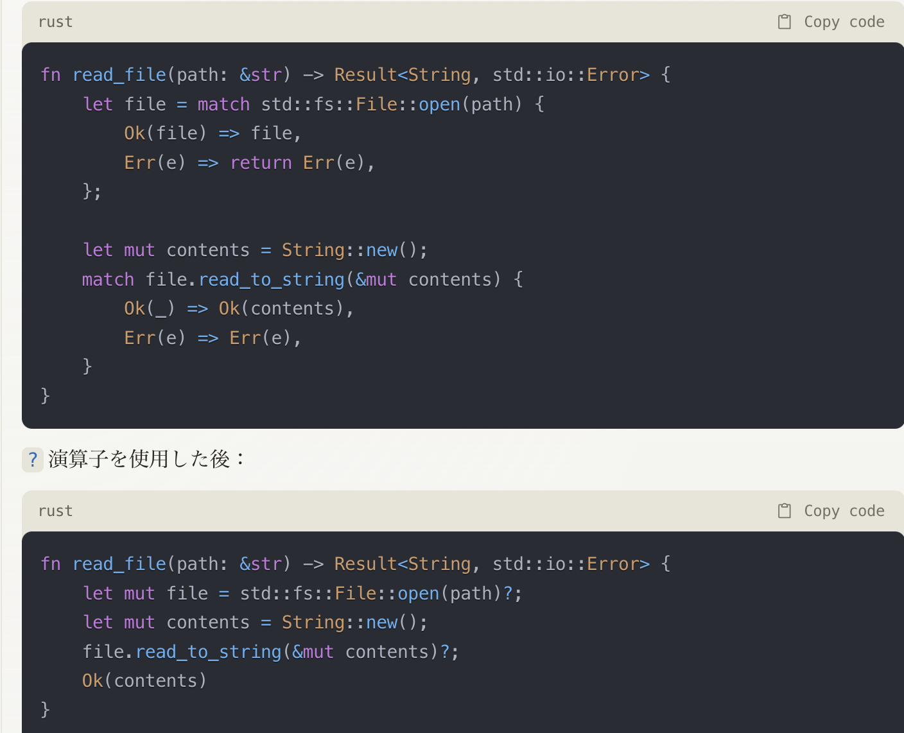
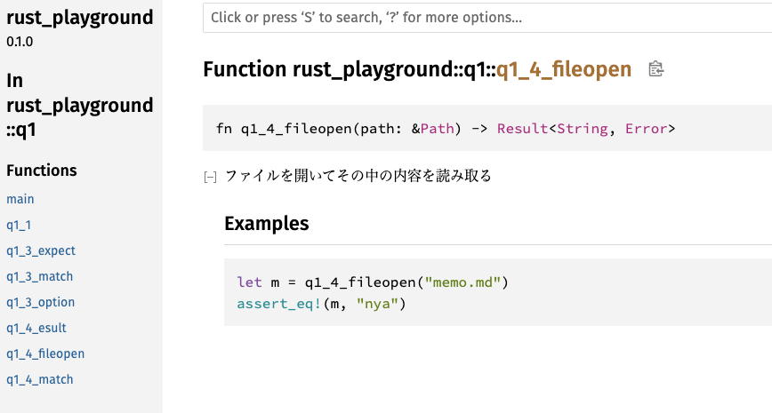
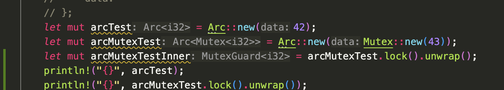
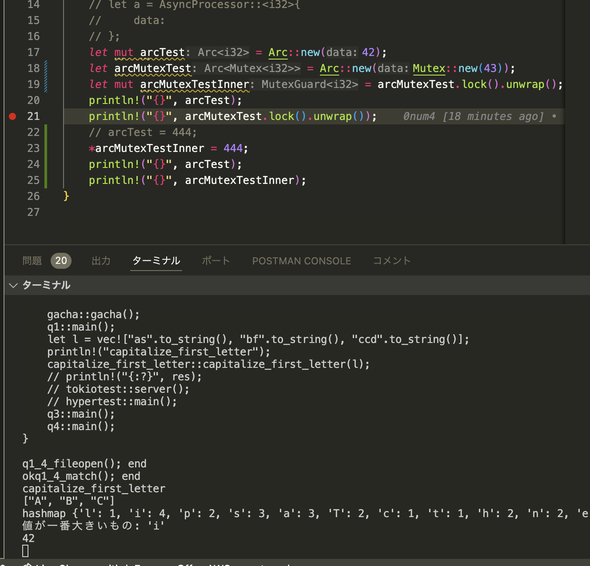
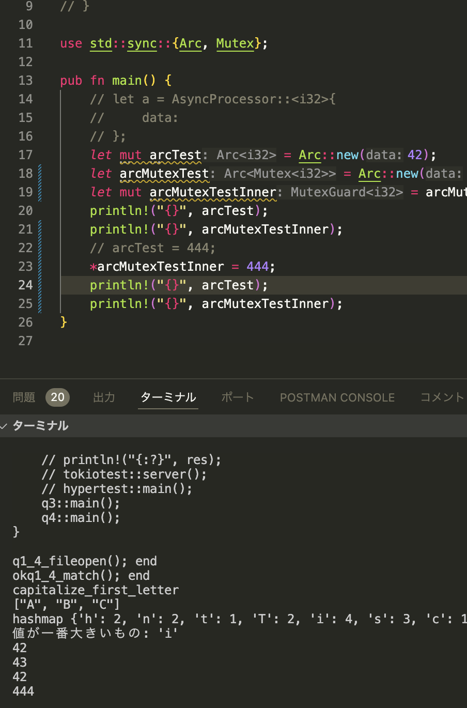

# rust-playground

[](https://github.com/0num4/rust-playground/actions/workflows/lint.yml)

```
cuargo run
```

## jansoul-gacha

## 各プロダクトの調査

### cleaning

```
cargo rustc --bin xxx -- -Dwarnings -Adead_code -Adeprecated && cargo fmt -- --check
```

が ci 上で走ってる

### mjai.app

```
https://github.com/smly/mjai.app/blob/fb34c4837a25c61e0cf17b6cfa6253611cdb5cb0/.github/workflows/cargo_test.yml#L26
```

cirgo fmt、clippy、test が走ってる

## tokio

**前提として rust の main は非同期にはできない。** #[tokio::main]をつけると、main 関数が非同期関数になる。

## await 演算子

rust の async/await は、Future を返す
Future に await をつけると、その Future が完了するまで待つ

## box について

https://zenn.dev/torohash/articles/5264df373d50af

rust において全ての変数はデフォルトでスタックに確保されるが、ヒープに確保したい場合は Box を使う。
box はメモリのヒープ領域に変数を置く
box は正確にはヒープ上の T におかれたスマートポインタ

## Result<(), \_>

\_の部分は任意のエラー型を返す

## dyn

dyn は trait を作成する時に使われる

## tokio2

tcplistener で listen 出来て、tcpstream で get できる

tcplistener や tcpstream は std::net::tcplistener と tokio::net::tcpstream がある。両者は Future を返すか返さないかの違いがあり.await が使えるか変わるので注意

## rust3

loop{}← これで無限ループが作れる

## tokio::spawn()

tokio runtime 上で新しいスレッドを作るための関数。
tokio::spawn は、Tokio ランタイム上で新しい非同期タスクを生成するための関数です。spawn 関数は、非同期の処理を別のタスクとして実行することを可能にし、メインタスクとは独立して並行に実行されます。

## async move {}

move キーワードは所有権を move する。
別のスレッドを作るときなどは move した方が良い

```
以下は、moveキーワードを使用しない場合の例です。
rustCopy codeuse std::sync::Arc;
use tokio;

#[tokio::main]
async fn main() {
    let data = Arc::new(vec![1, 2, 3, 4, 5]);

    let handle = tokio::spawn(async {
        // dataへの参照を使用する
        let sum = data.iter().sum::<i32>();
        println!("Sum: {}", sum);
    });

    // dataを変更する
    if let Some(value) = Arc::get_mut(&mut data) {
        value.push(6);
    }

    handle.await.unwrap();
}
```

# Q&A formatter が効かない

**[rust]セクションの "editor.defaultFormatter": "rust-lang.rust-analyzer"が一番重要**

.vscode/settings.json

```
{
  "editor.formatOnSave": true,
  "[rust]": {
    "editor.formatOnSave": true,
    "editor.defaultFormatter": "rust-lang.rust-analyzer"
  }
}

```

# use hyper_util::rt::TokioIo;が無い

cargo add tokio-util だけじゃだめ。
feature = ["full"]を追加しないと使えない

```
cargo add tokio-util --features full
```

# vec の操作

iter() の操作(検索)には find, filter,retain などがある。

**vec をそのまま検索したいときは get メソッドが使える！！**

# Result の基礎

Ok(val)で Result が作れる

?は剥がすのではなく伝搬させる
https://claude.ai/chat/0778e660-3c79-46fb-b1a4-b4757c03a484

# file::open

src/以下ではなくプロジェクト root をみる

# rust の test

`#[cfg(test)]`をつけるとコンパイル時に無視される。
rust test を実行したときしか`#[cfg(test)]`の内容はコンパイルされない
use super::\*;で親モジュールの関数を使える。test の場合は mod tests で{}スコープを分けるから親の関数を use super::\*;で使うことができる

test は pub を付ける必要がない。

# map と collect の謎

これは map の中が実行されない:thinking_face:

```
pub fn capitalize_first_letter(vecStr: Vec<String>) -> Vec<String> {
    let vecStr2 = vec!["a", "ff", "dddd"];
    let m = vecStr.iter().map(|x| {
        println!("aaa {:?}", x);
        x.to_string();
    });
    print!("{:?}", m);

    return Vec::new();
}

```

collect()を後ろにつけてこうすると map の中が実行された

```
pub fn capitalize_first_letter(vecStr: Vec<String>) -> Vec<String> {
    let vecStr2 = vec!["a", "ff", "dddd"];
    let m: Vec<_> = vecStr
        .iter()
        .map(|x| {
            println!("aaa {:?}", x);
            x.to_string();
        })
        .collect();
    print!("{:?}", m);

    return Vec::new();
}

```

map メソッドでは遅延評価がされるまで要素にふれるまで実行されない

こういうのは for に置き換えたほうがいいかも

# collect の型推論

`collect::<Vec<_>>()`のように collect は絶対型推論が必要

なぜなら collect は最終的な型の形がそこの推論に依存するので、つまり願えばなんでもできる魔法のメソッド

## collect 続き

https://qiita.com/hadashiA/items/d0c34a4ba74564337d2f
collect()は FromIterator<T>という trait の関数。

# hashMap もヤバくね？

上に関連してなんですが HashMap::new()も宣言した型に明示的に型をつけないといけない。普通に new()の引数で関数わたしたり HashMap::<i32,i32>new()みたいな感じじゃないんだ…

# &char も char も同じメソッドが使える

```
&charに対してもcharに対してもis_ascii_alphabetic()が使えるという認識でいいですか？はい、その認識で正しいです。is_ascii_alphabetic()メソッドは、char型の値に対して直接使用することも、&char型の参照に対して使用することもできます。
char型は、コピー可能な型（Copy traitを実装している型）の一つです。コピー可能な型は、値がコピーされるため、所有権の移動が発生せず、参照を取り外す必要がありません。
したがって、以下のように、char型の値に対しても、&char型の参照に対しても、is_ascii_alphabetic()メソッドを直接使用できます。
```

大体理解したので一旦終わり！

# rust doc

rust-analyzer 本当にキモくて///にすると doc として認識してくれる。
cargo doc でドキュメントを生成できる
生成されたものは target/doc 以下に html として生成される。


# rust の Arc や Rc について

https://qiita.com/qnighy/items/4bbbb20e71cf4ae527b9
Arc は参照カウントを使ったスマートポインタであり、データや状態を共有できる
Box の亜種っぽさを感じる。
Arc::new(42)で作成できる。ただしこの状態だと参照を共有してるので書き込めなくて、

# mutex について

Mutex::new()は基本的に display メソッドを持たない
lock()して unwrap()すると初めて中身が見える

mutex は可変性コンテナとも呼ばれる

```
ミューテックスは、2つの規則を覚えておく必要があるため、難しいという評判があります:

データを使用する前にロックの獲得を試みなければならない。
ミューテックスが死守しているデータの使用が終わったら、他のスレッドがロックを獲得できるように、 データをアンロックしなければならない。

```

Mutex から lock()をして unwrap()すると MutexGuard という型が返ってくる



lock()を取ってからもう一回 lock()を取ろうとするとずっと止まる。１つ目の lock が開放されないから

これはだめ(ずっと止まった状態になる)

これは OK


# threads について

thread::spawn で threads をつくる。
spawn の返り値は JoinHandle 型

std::thread を async にすることは出来ないので、tokio::spawn を使う
これはできない

```
pub fn q4_pre() {
    for i in 1..10 {
        let t = thread::spawn(|| {
            println!("5s待ちます");
            tokio::time::sleep(tokio::time::Duration::from_secs(5)).await?;
            println!("5s待ちました");
        });
        let t_res = t.join().unwrap();
        println!("{:?}", t_res)
    }
}

```

tokio::spawn なら join()は必要なくて、t.await で良い
